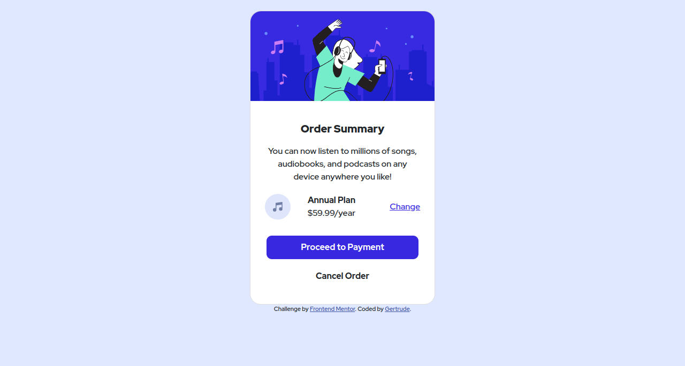

# Frontend Mentor - Order summary card solution

This is a solution to the [Order summary card challenge on Frontend Mentor](https://www.frontendmentor.io/challenges/order-summary-component-QlPmajDUj). Frontend Mentor challenges help you improve your coding skills by building realistic projects.

## Table of contents

- [Overview](#overview)
  - [The challenge](#the-challenge)
  - [Screenshot](#screenshot)
  - [Links](#links)
- [My process](#my-process)
  - [Built with](#built-with)
  - [Continued development](#continued-development)
  - [Useful resources](#useful-resources)
- [Author](#author)

## Overview

### The challenge

Users should be able to:

- See hover states for interactive elements

### Screenshot

### Links

- Solution URL: [GitHub](https://github.com/TrudyCyns/Order-Summary-Component)
- Live Site URL: [GitHub Pages](https://trudycyns.github.io/Order-Summary-Component/)

## My process

### Built with

- Semantic HTML5 markup
- CSS custom properties
- Flexbox
- Mobile-first workflow
- Bootstrap 5.1.3

### Continued development

I would like to refine the section before the buttons. Its spacing could be better.

### Useful resources

- [Bootstrap Website](https://getbootstrap.com/docs/5.1/components/card/) - This is where I got the card template. I like the components and will continue to use them.

## Author

- Frontend Mentor - [@TrudyCyns](https://www.frontendmentor.io/profile/TrudyCyns)
- Twitter - [@GNabasirye](https://www.twitter.com/GNabasirye)
